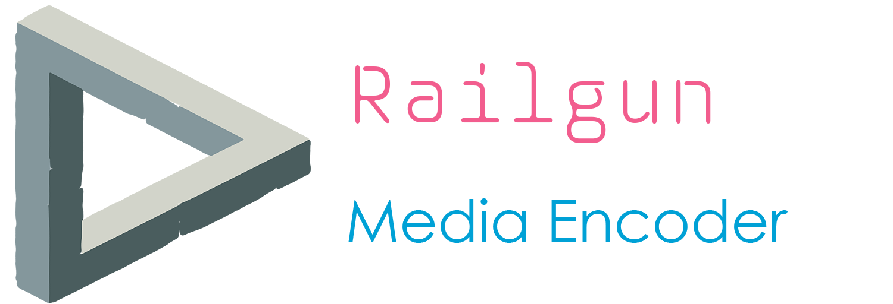
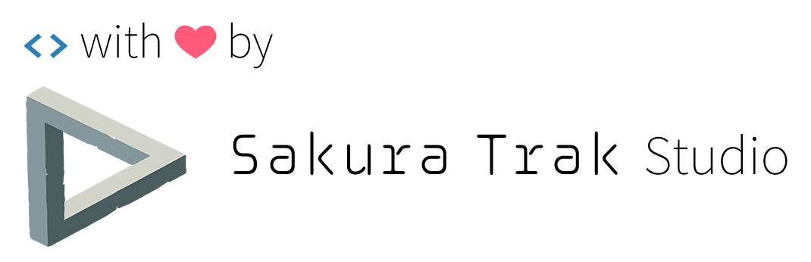

# Railgun Media Encoder



[中文文档](doc/readme_zh.md)

Railgun Media Encoder is a cross-platform Media Encoder GUI built with Angular and Electron.

## <del>Releases</del>

Railgun Media Encoder is still under development! Star the project or Watch Releases to be notified when the BETA Release is avaliable.

PRs welcome ^_^

## Developing

### Prepare and build

#### Tools required:

* git
* Node.js and npm
* Visual Studio Code(Strongly suggested) or other code editor

1. Get a copy of RailgunMediaEncoder. (Use git clone)
2. run command below to install required package  
`npm install`
3. run command below to run the project  
`npm start`

### Publish

 Run the following command to publish as Electron project.
 ```sh
 npm run clean # Clean the existing debug build
 npm run build-prod # Build the project in production level
 npm run publish # Build Electron Installer with electron-builder
 ```

### Lint

Run the following command run lint.
```sh
npm run lint
```

## About

Build with ❤ By EdgeNeko in SakuraTrak Studio
